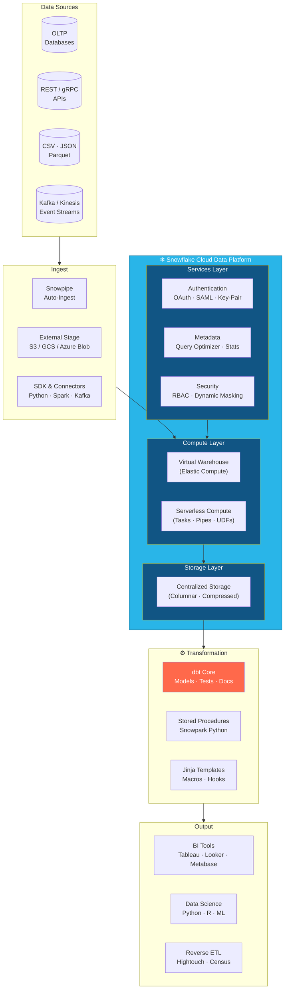
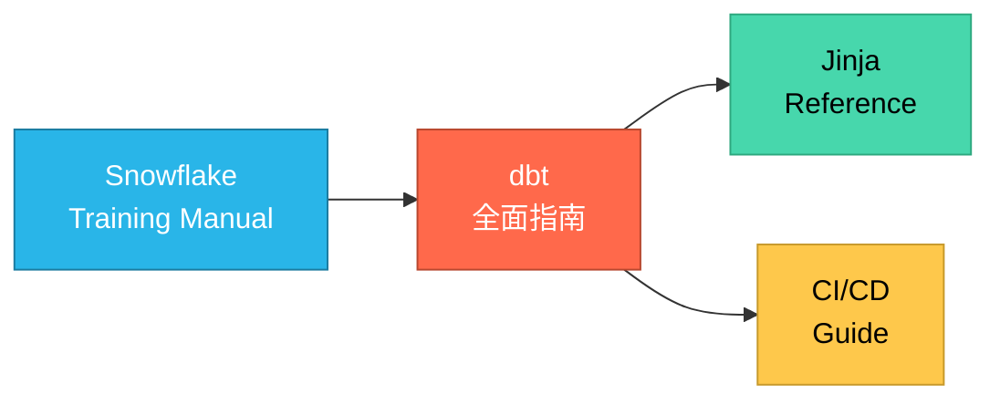

# SnowflakeLearing
For Snowflake Learing
<p align="center">
  
</p>

<p align="center">
  <a href="https://docs.snowflake.com/en/"></a>
  <a href="https://github.com/dbt-labs/dbt-core"></a>
  <a href="https://github.com/features/actions"></a>
  <a href="https://www.python.org/"></a>
</p>

<p align="center">
  <b>⚡ Modern Data Warehouse — クラウドネイティブ · dbt Transformation · CI/CD Automation</b>
</p>

---

##  Architecture Overview



##  Key Features

| Category | Capability |
|----------|------------|
|  **Separation** | Compute & storage scale independently — pay only for what you use |
|  **Zero-Copy Cloning** | Instant database/schema/table clones without extra storage |
|  **Time Travel** | Roll back up to 90 days; recover from accidental DROP / DELETE |
|  **Semi-structured Data** | Native VARIANT type — query JSON / Avro / Parquet with SQL |
|  **Secure Data Sharing** | Share live data across accounts without copying |
|  **Multi-Cloud** | AWS · Azure · GCP — same experience everywhere |
|  **Dynamic Masking** | Column-level security policy; no view boilerplate |
|  **Search Optimization** | Sub-second point lookups via pruning indexes |

## Repository Knowledge Base

This repository contains hands-on technical documentation covering Snowflake + dbt full-stack development. Navigate by role or topic below.

###  Start Here

| Document | Description | Audience |
|----------|-------------|----------|
| [**Snowflake Training Manual**](snowflake-training-manual.md) | ゼロから学ぶ Snowflake コア技術 | 新規メンバー / 入門者 |
| [**dbt 全面指南**](snowflake_dbt.md) | dbt Core 全貌 — Models · Tests · Snapshots · Seeds | Data Engineers |
| [**Jinja 过滤器 & 函数参考**](snowflake_dbt_jinja_reference.md) | dbt Jinja 完整リファレンス | Analytics Engineers |
| [**CI/CD 实施指南**](snowflake-dbt_cicd_guide.md) | dbt + Snowflake CI/CD 实战 (GitHub Actions) | DevOps / Platform |

###  Learning Path



###  Core Stack

<p align="center">
  <table>
    <tr>
      <td align="center" width="33%">
        <br/>
        <b>Snowflake</b><br/>
        Cloud Data Platform<br/>
        <sub>Enterprise Edition ↑</sub>
      </td>
      <td align="center" width="33%">
        <br/>
        <b>dbt Core</b><br/>
        Data Transformation<br/>
        <sub>v1.9+ · dbt-snowflake</sub>
      </td>
      <td align="center" width="33%">
        <br/>
        <b>Python Ecosystem</b><br/>
        Snowpark · Pandas · Jinja<br/>
        <sub>3.10+</sub>
      </td>
    </tr>
  </table>
</p>

##  Quick Start

### Prerequisites

```bash
# Python 3.10+
python --version

# dbt-snowflake
pip install dbt-snowflake

# SnowSQL CLI (optional)
curl -O https://sfc-repo.snowflakecomputing.com/snowsql/bootstrap/1.2/linux_x86_64/snowsql-1.2.33-linux_x86_64.bash
```

###  Project Structure (dbt)

```
dbt_project/
├── models/
│   ├── staging/        # Source-normalized views
│   ├── intermediate/   # Business logic composition
│   └── marts/          # Business-facing tables
├── tests/              # Custom data tests
├── seeds/              # Static CSV reference data
├── snapshots/          # Slowly Changing Dimensions
├── macros/             # Reusable Jinja blocks
├── analyses/           # Ad-hoc SQL
├── dbt_project.yml     # Project config
└── profiles.yml        # Connection config
```

###  CI/CD Pipeline

```
PR Open → dbt build (dev) → dbt test → Lint / Format
    ↓
Merge → dbt build (prod) → Run dbt snapshots → Notify
```

##  Commands Quick Reference

| Command | Purpose |
|---------|---------|
| `snowsql -c <connection>` | Connect via CLI |
| `put file://data.csv @my_stage` | Upload to internal stage |
| `copy into tbl from @my_stage` | Bulk load from stage |
| `create or replace table t clone t_prod` | Zero-copy clone |
| `undrop table t` | Recover dropped table |
| `select * from t at(timestamp => ...)` | Time Travel query |
| `dbt run` | Execute all models |
| `dbt test` | Run all tests |
| `dbt build` | run + test + seed + snapshot |
| `dbt docs generate && dbt docs serve` | Documentation portal |

## 📖 External Resources

- [Snowflake Documentation](https://docs.snowflake.com/)
- [dbt Documentation](https://docs.getdbt.com/)
- [Jinja Template Designer Docs](https://jinja.palletsprojects.com/en/3.1.x/templates/)
- [Snowflake Architecture Whitepaper](https://www.snowflake.com/resource/sigmod-2016-the-snowflake-elastic-data-warehouse/)

---

<p align="center">
  <sub>Built with ❄ for fast-paced data teams · Updated 2026-05-21</sub>
</p>

